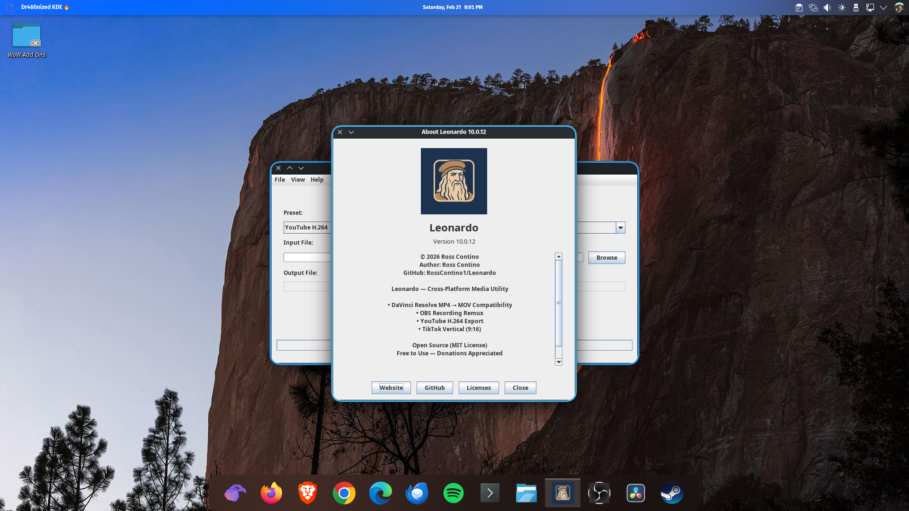
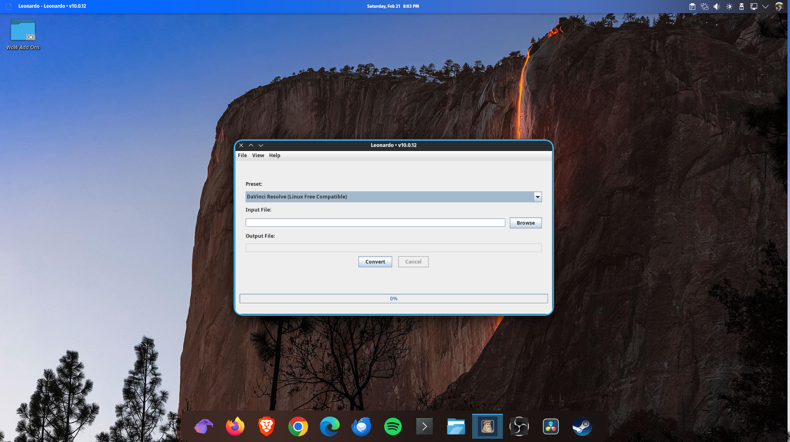

# Leonardo

Leonardo is a Linux media conversion tool built in Java with a focus on simplicity, portability, and reliability.
## Screenshots

## Features

* Audio and video conversion
* Clean desktop interface
* Linux AppImage distribution (no install required)
* Cross-platform (Linux, Windows planned, macOS planned)

## Requirements

Leonardo requires FFmpeg to be installed on your system.

### Install FFmpeg

**Arch / Garuda:**
sudo pacman -S ffmpeg

**Ubuntu / Debian:**
sudo apt install ffmpeg

**Fedora:**
sudo dnf install ffmpeg

## Leonardo 10.0.12

- Java/Eclipse rewrite of Leonardo
- Packaged as AppImage for Linux
- Improved FFmpeg integration
- Fixed GNOME icon issues
- Added GitHub link in menu
- Updated help system

Download the AppImage below.

Remember — at Bytes, Bread, and Barbecue we keep your code crispy and your files smokin’ hot.

## Linux (AppImage)

1. Download the AppImage
2. Make executable:
   chmod +x Leonardo-*.AppImage
3. Run:
   ./Leonardo-*.AppImage

## Donations

---

## ☕ Support Leonardo

Leonardo is free to use. If it saves you time (or brisket), consider supporting development:

Your support helps keep the code crispy and the files smokin’ hot.

## License

This project is licensed under the MIT License.

